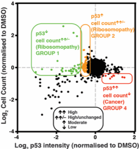

#

## Experiment

Compound screen with FDA approved compounds tested in RPS19-KD A549 cells at 4 different doses: 40nM, 210nm, 1.04µm, 5µm. Output variables were (average) p53 expression and (average) cell number. p53 expression and cell number were quantified using two different normalisation strategies:

1. Relative to a DMSO-treated non-targeting control
2. Relative to a DMSO-treated RPS19-KD

Results from the screening data were originally interpreted within the context of Diamand-Blackfan anemia (DBA) to help identifying compounds with a therapeutic potential leading to reduced p53 expression and increased cell count.


## Background

The goal is to establish a ranking of compounds according to their effect on (normalised) p53 expression and cell count. To that extend we define four quadrants

1. Increased p53 expression & increased cell count (top right quadrant)
2. Decreased p53 expression & increased cell count (top left quadrant)
3. Decreased p53 expression & decreased cell count (bottom left quadrant)
4. Increased p53 expression & decreased cell count (bottom right quadrant)



In the context of cancer, compounds that are located in the bottom right quadrant are the most interesting, as they lead to an increase in p53 expression and a decrease in cell count.

We use the Mahalanobis distance as a metric to score compounds according to their therapeutic potential.

Generally, the Mahalanobis distance measures the distance of a single multivariate data point from the full multivariate distribution. By extension, the Mahalanobis distance can be used to establish a measure of which data points constitute outliers. There is a paper by Wilks from 1963 where he shows that the Mahalanobis distances follow a Beta distribution; in order to implement an outlier test, one would compare the empirical Mahalanobis distances with the theoretical quantiles of the (scaled) Beta distribution. This allows to identify data points with Mahalanobis distances that are statistically significantly *different* (at some level α = 0.05) from the theoretical distribution, and hence constitute an outlier.

In this particular context, we use the Mahalanobis distance to measure the distance of a compound (characterised by its p53 intensity and cell count) from the distribution of all compounds. This is done by taking into account the covariance structure between p53 intensity and cell count, effectively down-weighting the directions with large covariance.

We want to avoid a statistical significance test (we could/would do that if we wanted to know if a compound constitutes an outlier or not), and instead we rank compounds (for every quadrant) from the largest to the smallest distance. For example, in quadrant 4, compounds with low ranks (i.e. large Mahalanobis distances) are then considered more effective in increasing p53 expression and decreasing cell count than compounds with a high rank (i.e. a small Mahalanobis distance).


## Analysis

All analyses and visualisations were done in R. A complete `sessionInfo()` can be found at the bottom of this document.

Following is a description of the individual R scripts that are part of this repository.

`tidy_data.R`: Read in and tidy up the original data stored in `00_original_data`. This R script gets called from within other R scripts, so there shouldn't be a need to manually `source` this script.

`make_animation.R`: Generate an animation of the p53 expression vs. cell count distribution as a function of different doses. This uses the R libraries `tweenr` and `animate` to interpolate between the dose measurements.

`plot_p53_cellcount_distr.R`: Generate a (static) plot of the p53 expression vs. cell count distribution at the 4 measured doses, based on data using the two different normalisation strategies.

`calc_Mahalanobis_dist.R`: Calculate Mahalanobis distances for every compound per quadrant per dose. Rank compounds according to the Mahalanobis distance, from largest to smallest. Generate a plot of the distribution of Mahalanobis distances for data normalised to the DMSO-treated RPS19-KD. Store results in CSV tables, one for every quadrant.


## Results

The following plot shows the distribution of (normalised) p53 expression and cell count measurements for all compounds at different doses, based on data using the two different normalisation strategies.


Alternatively, we show the same data in an animation, that interpolates between the measurements at different doses.


In both plots, the compound Flavopiridol in highlighted in red, the compound Dinaciclib in blue (the library contains two Dinaciclib compounds, presumably from two different companies). Also highlighted in yellow are all compounds that are listed to act on CDK.

The following table shows the top 20 compounds at a dose of 1.04µm (ranked by decreasing Mahalanobis distances) leading to an increase in p53 expression and decrease in cell count.

| Rank | name       | Drug.Name                       | Main.Target                                               | average.cell.count | average.p53.intensity | Mahalanobis_dist |
|------|------------|---------------------------------|-----------------------------------------------------------|--------------------|-----------------------|------------------|
| 1    | SN00737653 | Camptothecine_(S,+)             | Topoisomerase_I_inhibitor                                 | -0.621             | 1.496                 | 44.037           |
| 2    | SN00735670 | (S)-(+)-Camptothecin            | DNA_topoisomerase_I_inhibitor                             | -0.599             | 1.390                 | 38.767           |
| 3    | SN00756532 | Camptothecin                    | DNA_topoisomerase_inhibitor                               | -0.105             | 1.373                 | 24.844           |
| 4    | SN00750334 | Clofarabine                     | ribonucleotide_reductase                                  | -0.358             | 1.176                 | 23.578           |
| 5    | SN00750302 | Camptothecine                   | Topoisomerase                                             | -0.269             | 1.220                 | 22.904           |
| 6    | SN00735028 | cis-4-Aminocrotonic_acid        | GABA-C_receptor_agonist                                   | 0.000              | 1.328                 | 21.674           |
| 7    | SN00765797 | Ganetespib_(STA-9090)           | HSP90_and_its_client_proteins_inhibitor                   | -0.690             | 0.757                 | 21.042           |
| 8    | SN00755744 | Doxorubicin_hydrochloride       | Antitumor_antibiotic_agent._Inhibits_DNA_topoisomerase_II | -0.322             | 1.124                 | 21.034           |
| 9    | SN00750197 | 17-DMAG                         | HSP90                                                     | -0.515             | 0.956                 | 21.005           |
| 10   | SN00734830 | Mitoxantrone                    | DNA_synthesis_inhibitor                                   | -0.578             | 0.848                 | 19.870           |
| 11   | SN00737094 | Mitoxantrone_dihydrochloride    | DNA_topoisomerase_II_inhibitor                            | -0.494             | 0.926                 | 19.579           |
| 12   | SN00734812 | Topotecan_hydrochloride_hydrate | Topetecan_is_a_topoisomerase_I_inhibitor[…]               | -0.152             | 1.170                 | 18.986           |
| 13   | SN00755742 | Daunorubicin_hydrochloride      | RNA_synthesis_inhibitor                                   | -0.286             | 1.029                 | 17.400           |
| 14   | SN00750194 | Adriamycin                      | Topoisomerase                                             | -0.218             | 1.070                 | 17.223           |
| 15   | SN00750375 | JNJ_26854165                    | p53                                                       | -0.029             | 1.131                 | 15.998           |
| 16   | SN00737105 | Doxorubicin_hydrochloride       | DNA_intercalant,                                          | -0.089             | 1.084                 | 15.485           |
| 17   | SN00750391 | NVP-BEP800                      | HSP90                                                     | -0.120             | 1.064                 | 15.372           |
| 18   | SN00750409 | NVP-AUY922                      | HSP90                                                     | -0.862             | 0.098                 | 14.972           |
| 19   | SN00737604 | Cladribine                      | inhibits_the_enzyme_adenosine_deaminase                   | -0.152             | 1.007                 | 14.341           |
| 20   | SN00750333 | Cladribine                      | Antimetabolites                                           | -0.044             | 1.029                 | 13.396           |

Full results with ranking tables for every quadrant (and based on both normalisation methods) are given in subfolder of `02_tables`.


## References

- [Bottom to top explanation of the Mahalanobis distance?](https://stats.stackexchange.com/questions/62092/bottom-to-top-explanation-of-the-mahalanobis-distance)
- [Distribution of an observation-level Mahalanobis distance](https://stats.stackexchange.com/questions/20543/distribution-of-an-observation-level-mahalanobis-distance)
- [S. S. Wilks, Multivariate statistical outliers, Sankhya Series A, 25, 407–426 (1963)](https://www.jstor.org/stable/25049292?seq=1)

## `sessionInfo`

```r
sessionInfo()
#R version 3.6.1 (2019-07-05)
#Platform: x86_64-apple-darwin15.6.0 (64-bit)
#Running under: macOS Sierra 10.12.6
#
#Matrix products: default
#BLAS:   /Library/Frameworks/R.framework/Versions/3.6/Resources/lib/libRblas.0.dylib
#LAPACK: /Library/Frameworks/R.framework/Versions/3.6/Resources/lib/libRlapack.dylib
#
#locale:
#[1] en_AU.UTF-8/en_AU.UTF-8/en_AU.UTF-8/C/en_AU.UTF-8/en_AU.UTF-8
#
#attached base packages:
#[1] stats     graphics  grDevices utils     datasets  methods   base
#
#other attached packages:
# [1] tweenr_1.0.1    animation_2.6   ggtext_0.1.0    forcats_0.5.0
# [5] stringr_1.4.0   dplyr_0.8.4     purrr_0.3.3     readr_1.3.1
# [9] tidyr_1.0.2     tibble_2.1.3    ggplot2_3.3.0   tidyverse_1.3.0
#
#loaded via a namespace (and not attached):
# [1] Rcpp_1.0.3       cellranger_1.1.0 pillar_1.4.3     compiler_3.6.1
# [5] dbplyr_1.4.2     tools_3.6.1      jsonlite_1.6.1   lubridate_1.7.4
# [9] lifecycle_0.1.0  nlme_3.1-144     gtable_0.3.0     lattice_0.20-40
#[13] pkgconfig_2.0.3  rlang_0.4.5      reprex_0.3.0     cli_2.0.2
#[17] rstudioapi_0.11  DBI_1.1.0        haven_2.2.0      withr_2.1.2
#[21] xml2_1.2.2       httr_1.4.1       fs_1.3.1         generics_0.0.2
#[25] vctrs_0.2.3      hms_0.5.3        gridtext_0.1.1   grid_3.6.1
#[29] tidyselect_1.0.0 glue_1.3.1       R6_2.4.1         fansi_0.4.1
#[33] readxl_1.3.1     farver_2.0.3     modelr_0.1.6     magrittr_1.5
#[37] backports_1.1.5  scales_1.1.0     rvest_0.3.5      assertthat_0.2.1
#[41] colorspace_1.4-1 stringi_1.4.6    munsell_0.5.0    broom_0.5.5
#[45] crayon_1.3.4
```
